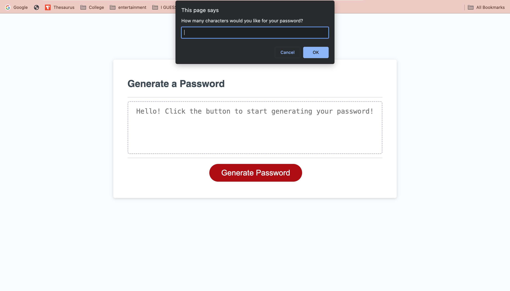
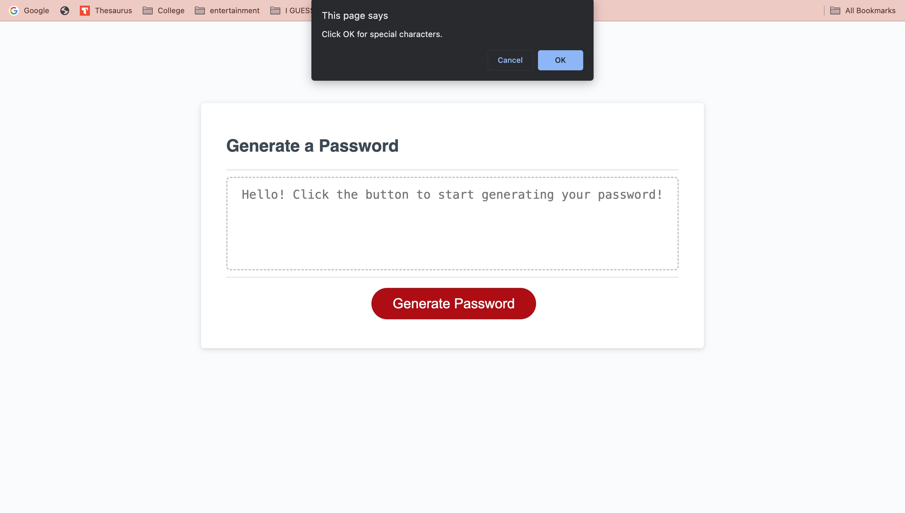
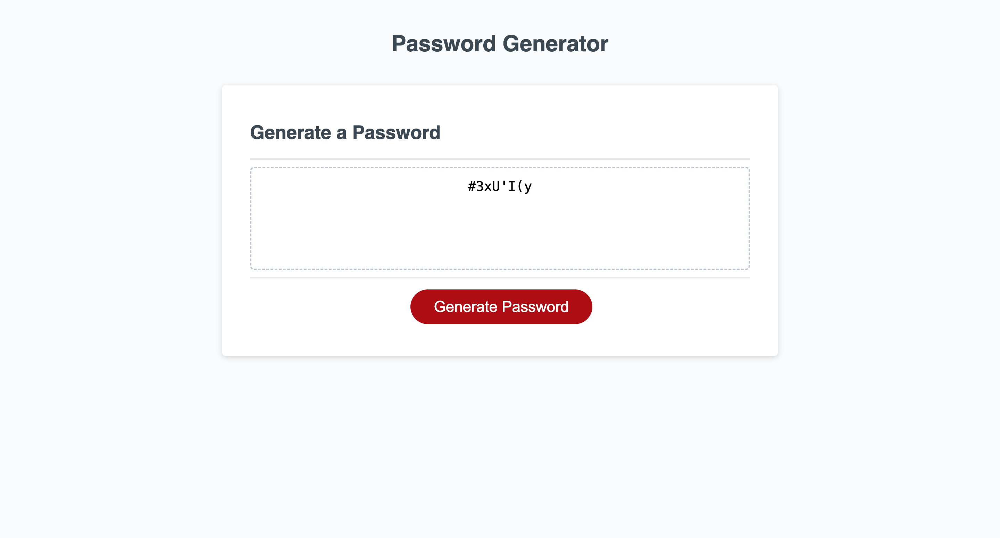
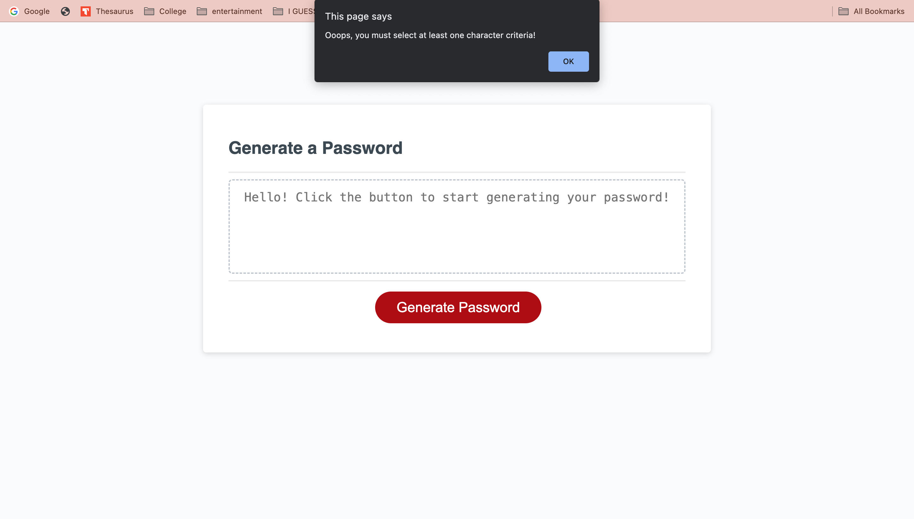

# passwordcreate-challenge3

I have modified starter code to redesign an application that enables users to generate random passwords based on the user's selections.

This includes:

- Clickable button
- Alerts presenting prompts for password criteria
- The generated password is displayed

## Tech Used

- The starter code was assigned by Columbia Engineering Coding Boot Camp.

- HTML

- CSS

- JavaScript

## Screenshots

- Here is an error alert:
  

## Deployed Application

https://nat-rodriguez.github.io/passwordcreate-challenge3/
